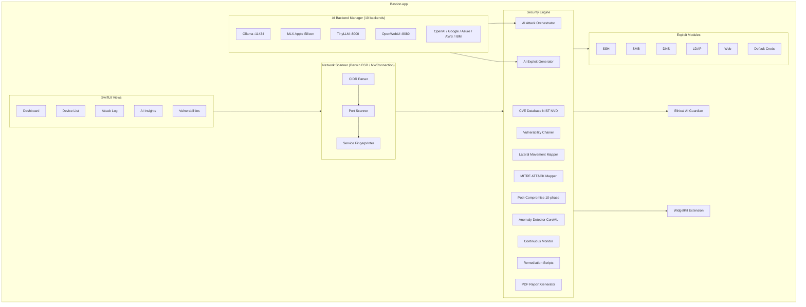

# Bastion


[](LICENSE)


**AI-powered network penetration testing for macOS.** Bastion combines native
Swift network scanning with multi-backend AI orchestration to discover devices,
identify vulnerabilities, chain exploits, map lateral movement paths, and
generate professional security reports -- all from a single SwiftUI application
running natively on Apple Silicon.

Written by Jordan Koch ([@kochj23](https://github.com/kochj23)).

---

## Architecture



<!-- Legacy ASCII diagram preserved for non-Mermaid renderers -->
<details>
<summary>ASCII architecture diagram</summary>

```
+-------------------------------------------------------------------+
|                         Bastion.app                                |
|                                                                    |
|  +---------------------+     +-------------------------------+    |
|  |     SwiftUI Views    |     |      AI Backend Manager       |    |
|  |                      |     |                               |    |
|  |  Dashboard           |     |  Ollama  (localhost:11434)    |    |
|  |  Device List         |     |  MLX     (Apple Silicon)      |    |
|  |  Attack Log          |     |  TinyLLM (localhost:8000)     |    |
|  |  AI Insights         |     |  TinyChat(localhost:8000)     |    |
|  |  Vulnerabilities     |     |  OpenWebUI(localhost:8080)    |    |
|  |  Settings            |     |  OpenAI / Google / Azure /    |    |
|  +----------+-----------+     |  AWS Bedrock / IBM Watson     |    |
|             |                 +-------+-----------------------+    |
|             v                         |                            |
|  +----------+-----------+             |                            |
|  |   Network Scanner     |<-----------+                            |
|  |   (Darwin BSD / NW)   |                                         |
|  +----------+-----------+                                          |
|             |                                                      |
|             v                                                      |
|  +----------+----------------------------------------------------+ |
|  |                    Security Engine                             | |
|  |                                                                | |
|  |  +------------------+  +-------------------+  +--------------+ | |
|  |  | CVE Database     |  | Service           |  | Exploit      | | |
|  |  | (NIST NVD)       |  | Fingerprinter     |  | Modules      | | |
|  |  +------------------+  +-------------------+  |  SSH, SMB,   | | |
|  |                                                |  DNS, LDAP,  | | |
|  |  +------------------+  +-------------------+  |  Web, Creds  | | |
|  |  | AI Attack        |  | AI Exploit        |  +--------------+ | |
|  |  | Orchestrator     |  | Generator         |                   | |
|  |  +------------------+  +-------------------+                   | |
|  |                                                                | |
|  |  +------------------+  +-------------------+  +--------------+ | |
|  |  | Vulnerability    |  | Lateral Movement  |  | MITRE ATT&CK | | |
|  |  | Chainer          |  | Mapper            |  | Mapper        | | |
|  |  +------------------+  +-------------------+  +--------------+ | |
|  |                                                                | |
|  |  +------------------+  +-------------------+  +--------------+ | |
|  |  | Post-Compromise  |  | Timeline          |  | Anomaly      | | |
|  |  | Module (10-phase)|  | Reconstructor     |  | Detector     | | |
|  |  +------------------+  +-------------------+  +--------------+ | |
|  |                                                                | |
|  |  +------------------+  +-------------------+  +--------------+ | |
|  |  | Remediation      |  | Continuous        |  | PDF Report   | | |
|  |  | Script Generator |  | Monitor           |  | Generator    | | |
|  |  +------------------+  +-------------------+  +--------------+ | |
|  +----------------------------------------------------------------+ |
|                                                                    |
|  +-------------------------------+  +---------------------------+  |
|  |  Ethical AI Guardian          |  |  WidgetKit Extension      |  |
|  |  Content monitoring, TOS,     |  |  Security score, vuln     |  |
|  |  prohibited-use detection     |  |  counts, last scan time   |  |
|  +-------------------------------+  +---------------------------+  |
+-------------------------------------------------------------------+
```
</details>

---

## Features

### Network Reconnaissance

- **Pure-Swift network scanner** built on Darwin BSD sockets and the Network
  framework -- no dependency on nmap or other external tools.
- CIDR-based host discovery (`/24` and `/16` subnets) with concurrent TCP
  connect probes.
- Port scanning across 23 common ports (FTP, SSH, Telnet, HTTP, HTTPS, SMB,
  RDP, database ports, and more).
- Reverse DNS hostname resolution.
- Service fingerprinting and banner grabbing via raw TCP connections.
- OS detection heuristics based on exposed service combinations.
- Quick-scan mode for fast top-10-port sweeps.

### AI-Powered Attack Orchestration

- **AI Attack Orchestrator** builds intelligent attack plans by analyzing the
  full threat landscape across every discovered device, ranking targets by
  exploitability, predicting success probabilities, and identifying multi-step
  attack chains.
- **AI Exploit Generator** reads CVE descriptions and produces working
  proof-of-concept exploit code (Python, Bash, Ruby) tailored to the specific
  target and vulnerability.
- **Vulnerability Chainer** identifies multi-step exploitation paths:
  information-disclosure-to-privilege-escalation, SQL-injection-to-RCE,
  path-traversal-to-credential-theft, XSS-to-admin-takeover, and
  exploit-to-persistence chains.
- **Lateral Movement Mapper** discovers trust relationships (SSH key reuse,
  shared credentials, flat network segmentation) and builds single-hop and
  multi-hop pivot paths.
- **Post-exploitation planner** suggests privilege escalation, persistence,
  lateral movement, and data-exfiltration steps after a device is compromised.
- AI self-improvement loop: the exploit generator learns from successful and
  failed attempts, analyzing patterns every 10 runs to improve future
  success rates.

### Post-Compromise Assessment

A 10-phase forensic assessment module that connects to a target over SSH and
performs deep inspection:

| Phase | Module                    | What it detects                                   |
|-------|---------------------------|---------------------------------------------------|
| 1     | Rootkit Detector          | Kernel and userland rootkits                      |
| 2     | Suspicious User Detector  | UID-0 accounts, empty passwords, anomalous shells |
| 3     | Backdoor Detector         | Unauthorized listening ports and services          |
| 4     | Hidden Process Detector   | Processes hidden from `ps` / `/proc`              |
| 5     | Binary Integrity Checker  | Modified system binaries (trojaned `ls`, `ps`, etc.)|
| 6     | Persistence Detector      | Cron jobs, init scripts, authorized_keys           |
| 7     | Kernel Module Analyzer    | Suspicious or unsigned kernel modules              |
| 8     | Log Tampering Detector    | Cleared logs, gaps in timestamps, truncated files  |
| 9     | Network Sniffer Detector  | Promiscuous interfaces and packet-capture tools    |
| 10    | AI Analysis               | Natural-language forensic summary of all findings  |

### CVE Database

- Downloads and caches critical/high-severity CVEs from NIST NVD.
- Maps discovered services to known vulnerabilities.
- Provides CVSS scores and severity ratings for every finding.

### MITRE ATT&CK Mapping

- All vulnerabilities and attack results are mapped to MITRE ATT&CK techniques
  and tactics (T1046, T1021, T1078, T1059, T1068, T1110, T1190, T1210, and
  more).
- Exportable ATT&CK Navigator JSON for heatmap visualization.
- Covers all 14 ATT&CK tactics from Reconnaissance through Impact.

### Continuous Monitoring and Anomaly Detection

- Scheduled scans at configurable intervals with baseline diffing.
- Anomaly detector built on CreateML/CoreML that learns normal device behavior
  profiles and flags deviations (new ports, new devices, changed services).
- macOS notifications for security alerts.
- Full scan history with timeline tracking.

### Forensic Timeline Reconstruction

- Rebuilds the attacker's activity sequence from post-compromise evidence.
- Phases: Reconnaissance, Initial Access, Privilege Escalation, Persistence,
  Lateral Movement, and Objective.
- AI-generated attack narrative for inclusion in incident-response reports.

### Remediation

- **Remediation Script Generator** produces hardening bash scripts per device
  covering SSH, web server, SMB, and DNS configuration.
- AI-enhanced recommendations tailored to the specific vulnerability profile.
- Exportable exploitation-chain scripts for authorized red-team engagements.

### Reporting

- **Enterprise PDF reports** generated with PDFKit: title page, executive
  summary, network overview, per-device vulnerability details, and AI analysis.
- MITRE ATT&CK Navigator JSON export.
- All scan logs available in the UI and exportable.

### macOS WidgetKit Widget

- Dashboard widget in three sizes (Small, Medium, Large) displaying overall
  security score, vulnerability breakdown by severity, devices at risk, last
  scan time, and network info.
- Auto-syncs after each scan via App Group shared UserDefaults
  (`group.com.jkoch.bastion`).
- Updates every 15 minutes.

### Ethical AI Safeguards

- Comprehensive content monitoring with 100+ prohibited-use patterns.
- Automatic blocking of illegal, harmful, and abusive content.
- Crisis resource referrals (988 Suicide Prevention, Crisis Text Line,
  Domestic Violence Hotline).
- Hashed usage logging for audit (not plaintext).
- Legal compliance (CSAM reporting obligations).
- Terms of Service enforcement -- see
  [ETHICAL_AI_TERMS_OF_SERVICE.md](./ETHICAL_AI_TERMS_OF_SERVICE.md).

---

## AI Backends

Bastion supports 10 AI backends. Local backends require no API keys and keep
all data on your machine. Cloud backends offer higher-capability models.

| Backend    | Type  | Default Endpoint             | Notes                                    |
|------------|-------|------------------------------|------------------------------------------|
| Ollama     | Local | `localhost:11434`            | Preferred default; pull any GGUF model   |
| MLX        | Local | Python subprocess            | Apple Silicon native via `mlx-lm`        |
| TinyLLM    | Local | `localhost:8000`             | Lightweight OpenAI-compatible server     |
| TinyChat   | Local | `localhost:8000`             | Fast chatbot with streaming/markdown     |
| OpenWebUI  | Local | `localhost:8080` or `:3000`  | Self-hosted AI platform                  |
| OpenAI     | Cloud | OpenAI API                   | GPT-4o                                   |
| Google     | Cloud | Vertex AI                    | Vision, Speech                           |
| Azure      | Cloud | Cognitive Services           | Full Azure AI suite                      |
| AWS        | Cloud | Bedrock, Rekognition, Polly  | Full AWS AI suite                        |
| IBM Watson | Cloud | NLU, Speech, Discovery       | Natural language understanding           |

Auto mode probes each backend in priority order (Ollama first) and selects the
first available.

---

## Exploit Modules

Built-in protocol-specific testing modules:

| Module              | Protocol / Target          |
|---------------------|----------------------------|
| SSHModule           | SSH brute force, key auth  |
| SMBModule           | SMB/CIFS, EternalBlue      |
| DNSModule           | DNS zone transfer, cache   |
| LDAPModule          | LDAP enumeration, binds    |
| WebModule           | HTTP/HTTPS, SQLi, XSS, traversal |
| DefaultCredsModule  | Common default credentials |

---

## Responsible Use

Bastion is designed exclusively for **authorized security testing**,
penetration testing engagements, CTF competitions, and educational purposes.
The application enforces RFC 1918 local IP scanning only (192.168.x.x,
10.x.x.x, 172.16-31.x.x). All activities are logged for audit purposes.

Always obtain proper written authorization before scanning or testing systems
you do not own. Unauthorized access to computer systems is illegal under:

- Computer Fraud and Abuse Act (CFAA) -- United States
- Computer Misuse Act -- United Kingdom
- Equivalent legislation in your jurisdiction

A legal warning dialog with explicit acknowledgment is required at every
application launch.

---

## Installation

Bastion is distributed as a DMG installer. It is not available on the Mac App
Store.

### From DMG (recommended)

```
open Bastion-vX.Y.Z.dmg
# Drag Bastion.app to /Applications
```

### From Source

```bash
cd /Volumes/Data/xcode/Bastion
xcodebuild -project Bastion.xcodeproj \
           -scheme Bastion \
           -configuration Release \
           build
cp -R build/Release/Bastion.app /Applications/
```

Requires Xcode 15+ and macOS 13.0 Ventura or later.

### AI Backend Setup (optional)

```bash
# Ollama (recommended -- free, local, private)
brew install ollama
ollama serve
ollama pull mistral:latest

# MLX (Apple Silicon only)
pip install mlx-lm

# Or configure any cloud backend in Settings -> AI Backend
```

---

## Usage

1. Launch Bastion. Accept the legal disclaimer on first run.
2. Enter a target CIDR (e.g., `192.168.1.0/24`) and click **Scan Network**.
3. Review discovered devices in the **Device List** tab.
4. Open **AI Insights** to see the AI-generated attack plan with ranked targets
   and exploitation chains.
5. Inspect individual devices in **Device Detail** for open ports, services,
   vulnerabilities, and CVE matches.
6. Use the **Attack** menu to run AI-recommended attacks or trigger a full
   assault.
7. After compromise, run the **Post-Compromise Assessment** for 10-phase
   forensic inspection.
8. Export a PDF report or MITRE ATT&CK Navigator JSON from the dashboard.

### Keyboard Shortcuts

| Shortcut                    | Action                   |
|-----------------------------|--------------------------|
| Cmd+N                       | New Scan                 |
| Cmd+S                       | Stop Scan                |
| Cmd+Q                       | Quick Scan               |
| Cmd+R                       | Run AI Attack Plan       |
| Cmd+Option+Shift+X          | Full Assault Mode        |
| Cmd+.                       | Emergency Stop           |
| Cmd+Option+B                | AI Backend Settings      |
| Cmd+1 through Cmd+5         | Switch view tabs         |

---

## Technical Details

- **Language:** Swift 5.9, SwiftUI
- **Minimum OS:** macOS 13.0 (Ventura)
- **Architecture:** Apple Silicon native (arm64), Universal binary supported
- **Sandbox:** Disabled (`com.apple.security.app-sandbox = false`) -- network
  scanning, SSH connections, and raw socket access require full system
  permissions.
- **App Group:** `group.com.jkoch.bastion` (shared data with WidgetKit
  extension)
- **Network layer:** Darwin BSD sockets via the `Network` framework
  (`NWConnection`); no external tool dependencies.
- **AI integration:** OpenAI-compatible HTTP APIs for all local and cloud
  backends; Python `Process` subprocess for MLX.
- **CVE data:** Cached in `~/Library/Application Support/Bastion/CVE/`.
- **PDF generation:** Native `PDFKit` + `CGContext` rendering.
- **Anomaly detection:** `CreateML` / `CoreML` for on-device behavior
  profiling.
- **Concurrency:** Swift structured concurrency (`async`/`await`, `TaskGroup`)
  throughout.

---

## Project Structure

```
Bastion/
  BastionApp.swift              App entry point, legal warning, main UI
  AI/
    AIBackendManager.swift       Multi-backend AI manager (10 backends)
    AIAttackOrchestrator.swift   Network-wide attack planning
    AIExploitGenerator.swift     CVE-to-exploit code generation
  AICapabilities/
    UnifiedAICapabilities.swift  Unified capability detection
    ImageGenerationUnified.swift Image generation backends
    VoiceUnified.swift           Voice/speech backends
    AnalysisUnified.swift        Analysis backends
    SecurityUnified.swift        Security-specific AI
  Models/
    Device.swift                 Device, Port, Service, Vulnerability models
    CVE.swift                    CVE data model
    AttackResult.swift           Attack outcome tracking
    CompromiseReport.swift       Post-compromise assessment report
  Security/
    NetworkScanner.swift         Pure-Swift CIDR scanner
    CVEDatabase.swift            NIST NVD downloader and cache
    ServiceFingerprinter.swift   Banner grabbing and version detection
    ComprehensiveDeviceTester.swift  Full device security audit
    VulnerabilityChainer.swift   Multi-step exploit chain builder
    LateralMovementMapper.swift  Network pivot path discovery
    MITREATTACKMapper.swift      ATT&CK technique/tactic mapping
    ContinuousMonitor.swift      Scheduled scan and alert engine
    AnomalyDetector.swift        ML-based behavior anomaly detection
    TimelineReconstructor.swift  Forensic attack timeline builder
    RemediationScriptGenerator.swift  Hardening script output
    ExploitModules/
      SSHModule.swift            SSH-specific testing
      SMBModule.swift            SMB/CIFS testing
      DNSModule.swift            DNS testing
      LDAPModule.swift           LDAP testing
      WebModule.swift            HTTP/HTTPS testing
      DefaultCredsModule.swift   Default credential testing
    PostCompromise/
      PostCompromiseModule.swift  10-phase assessment orchestrator
      RootkitDetector.swift      Rootkit scanning
      BackdoorDetector.swift     Backdoor scanning
      HiddenProcessDetector.swift  Hidden process detection
      SuspiciousUserDetector.swift  User account analysis
      PersistenceDetector.swift  Persistence mechanism scanning
      KernelModuleAnalyzer.swift Kernel module inspection
      LogTamperingDetector.swift Log integrity checking
      NetworkSnifferDetector.swift  Promiscuous mode detection
      BinaryIntegrityChecker.swift  System binary hash verification
      BinaryHashDatabase.swift   Known-good hash database
  Utilities/
    SSHConnection.swift          SSH client for post-compromise
    PDFGenerator.swift           Enterprise PDF report output
    WidgetDataSync.swift         Widget data sync via App Group
    SafetyValidator.swift        Input validation
    ModernDesign.swift           Glassmorphic UI styling
  Views/
    DashboardView.swift          Main dashboard with scan controls
    DeviceListView.swift         Discovered device list
    DeviceDetailView.swift       Per-device detail inspector
    AttackLogView.swift          Attack execution log
    AIInsightsView.swift         AI recommendations and plans
    VulnerabilitiesView.swift    Vulnerability browser
    SettingsView.swift           Backend and scan configuration

Bastion Widget/
  BastionWidget.swift            WidgetKit entry point
  SharedDataManager.swift        Shared App Group data reader
  WidgetData.swift               Widget data models
```

---

## How Bastion Compares

| Feature                           | Bastion              | Metasploit           | Burp Suite         |
|-----------------------------------|----------------------|----------------------|--------------------|
| AI-powered exploit selection      | Yes (10 backends)    | No                   | No                 |
| AI exploit code generation        | Yes                  | No                   | No                 |
| Vulnerability chain analysis      | Yes                  | No                   | No                 |
| Lateral movement mapping          | Yes                  | Limited              | No                 |
| MITRE ATT&CK mapping             | Yes                  | Limited              | No                 |
| Post-compromise forensics         | Yes (10-phase)       | Post modules         | No                 |
| Native macOS app                  | Yes (SwiftUI)        | No (CLI/Java)        | No (Java)          |
| Local AI (no cloud required)      | Yes                  | N/A                  | N/A                |
| Apple Silicon native              | Yes                  | No                   | No                 |
| WidgetKit dashboard               | Yes                  | No                   | No                 |
| PDF report generation             | Yes                  | Yes                  | Yes                |
| Free and open source              | Yes (MIT)            | Community Edition    | No                 |

---

## Download

Download the latest release:
[Bastion on GitHub Releases](https://github.com/kochj23/Bastion/releases/latest)

---

## Test Suite

Bastion includes a comprehensive XCTest suite covering models, security logic,
MITRE ATT&CK mapping, vulnerability chaining, and safety enforcement.

**140 tests, 0 failures** across 10 test classes:

| Test Class | Tests | Coverage Area |
|---|---|---|
| `DeviceModelTests` | 22 | Device, OpenPort, ServiceInfo, risk levels, security score |
| `CVEModelTests` | 17 | CVE severity mapping, Codable round-trips, VulnerabilitySeverity |
| `AttackResultTests` | 12 | AttackResult, AttackStatus, AttackType, ScanResults |
| `SafetyValidatorTests` | 14 | RFC 1918 enforcement, public IP blocking, rate limiting |
| `CompromiseReportTests` | 22 | Post-compromise findings, assessment logic, all finding types |
| `MITREATTACKMapperTests` | 16 | ATT&CK technique/tactic mapping, Navigator JSON export |
| `VulnerabilityChainerTests` | 8 | Chain probability calculation, chain types |
| `LateralMovementTests` | 8 | Trust relationships, movement paths, multi-hop filtering |
| `AIBackendTests` | 16 | Backend enum, error types, AttackPlan, PostExploitationPlan |
| `NetworkErrorTests` | 5 | NetworkError, CVEDatabaseError, CVEMetadata |

### Running Tests

```bash
xcodebuild test -project Bastion.xcodeproj -scheme Bastion \
  -configuration Debug -destination 'platform=macOS' \
  -only-testing BastionTests
```

---

## License

MIT License -- see [LICENSE](./LICENSE).

Ethical usage required -- see
[ETHICAL_AI_TERMS_OF_SERVICE.md](./ETHICAL_AI_TERMS_OF_SERVICE.md).

Copyright (c) 2026 Jordan Koch. All rights reserved.

---

## More Apps by Jordan Koch

| App | Description |
|-----|-------------|
| [NMAPScanner](https://github.com/kochj23/NMAPScanner) | Network security scanner with AI threat detection |
| [MLXCode](https://github.com/kochj23/MLXCode) | Local AI coding assistant for Apple Silicon |
| [URL-Analysis](https://github.com/kochj23/URL-Analysis) | Network traffic analysis and URL monitoring |
| [TopGUI](https://github.com/kochj23/TopGUI) | macOS system monitor with real-time metrics |
| [rtsp-rotator](https://github.com/kochj23/rtsp-rotator) | RTSP camera stream rotation and monitoring |

[View all projects](https://github.com/kochj23?tab=repositories)

---

> Disclaimer: This is a personal project created on my own time. It is not
> affiliated with, endorsed by, or representative of my employer.
