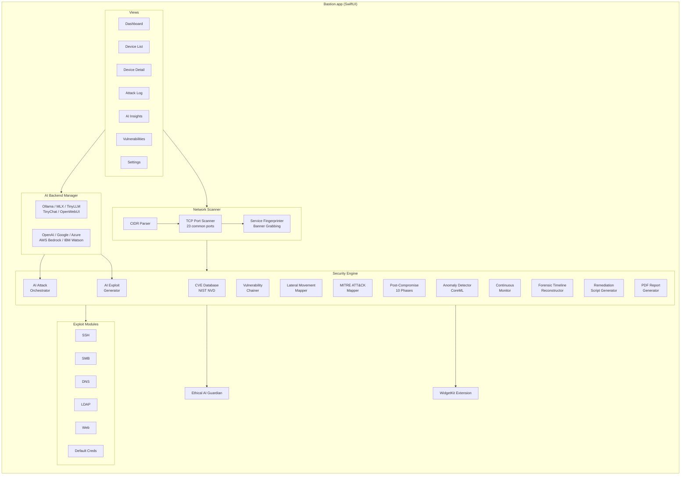

# Bastion


[](LICENSE)


**AI-powered network penetration testing for macOS.** Bastion combines pure-Swift network scanning with multi-backend AI orchestration to discover devices, identify vulnerabilities, chain exploits, map lateral movement paths, and generate professional security reports -- all from a native SwiftUI application on Apple Silicon.

Written by Jordan Koch ([@kochj23](https://github.com/kochj23)).

---

## Architecture



---

## Features

### Network Reconnaissance

| Capability | Detail |
|---|---|
| Host Discovery | CIDR-based scanning (/24 and /16 subnets) with concurrent TCP connect probes |
| Port Scanning | 23 common ports (FTP, SSH, Telnet, HTTP, HTTPS, SMB, RDP, databases) |
| Service Fingerprinting | Banner grabbing and version detection via raw TCP connections |
| OS Detection | Heuristic identification based on exposed service combinations |
| Quick Scan | Fast top-10-port sweep mode |
| DNS Resolution | Reverse DNS hostname lookup |

Built on Darwin BSD sockets and the Network framework (`NWConnection`) -- no dependency on nmap or external tools.

### AI-Powered Attack Orchestration

- **AI Attack Orchestrator** -- Analyzes the full threat landscape, ranks targets by exploitability, predicts success probabilities, and identifies multi-step attack chains.
- **AI Exploit Generator** -- Reads CVE descriptions and produces proof-of-concept exploit code (Python, Bash, Ruby) tailored to target and vulnerability. Self-improvement loop analyzes patterns every 10 runs.
- **Vulnerability Chainer** -- Identifies multi-step exploitation paths: info-disclosure-to-privilege-escalation, SQLi-to-RCE, path-traversal-to-credential-theft, XSS-to-admin-takeover, and exploit-to-persistence chains.
- **Lateral Movement Mapper** -- Discovers trust relationships (SSH key reuse, shared credentials, flat network segmentation) and builds single-hop and multi-hop pivot paths.

### Post-Compromise Assessment (10 Phases)

Connects to a target over SSH and performs deep forensic inspection:

| Phase | Module | What It Detects |
|---|---|---|
| 1 | Rootkit Detector | Kernel and userland rootkits |
| 2 | Suspicious User Detector | UID-0 accounts, empty passwords, anomalous shells |
| 3 | Backdoor Detector | Unauthorized listening ports and services |
| 4 | Hidden Process Detector | Processes hidden from `ps` / `/proc` |
| 5 | Binary Integrity Checker | Modified system binaries (trojaned `ls`, `ps`, etc.) |
| 6 | Persistence Detector | Cron jobs, init scripts, authorized_keys |
| 7 | Kernel Module Analyzer | Suspicious or unsigned kernel modules |
| 8 | Log Tampering Detector | Cleared logs, timestamp gaps, truncated files |
| 9 | Network Sniffer Detector | Promiscuous interfaces and packet-capture tools |
| 10 | AI Analysis | Natural-language forensic summary of all findings |

### CVE Database and MITRE ATT&CK

- Downloads and caches critical/high-severity CVEs from NIST NVD
- Maps services to known vulnerabilities with CVSS scores
- All findings mapped to MITRE ATT&CK techniques and tactics
- Exportable ATT&CK Navigator JSON for heatmap visualization
- Covers all 14 ATT&CK tactics from Reconnaissance through Impact

### Continuous Monitoring and Anomaly Detection

- Scheduled scans at configurable intervals with baseline diffing
- CoreML-based anomaly detector learns normal device behavior and flags deviations
- macOS notifications for security alerts
- Full scan history with timeline tracking

### Reporting and Remediation

- **PDF reports** via PDFKit: title page, executive summary, network overview, per-device vulnerability details, AI analysis
- **Remediation scripts** -- Hardening bash scripts per device covering SSH, web, SMB, and DNS
- **Forensic timeline** -- Rebuilds attacker activity sequence from post-compromise evidence with AI-generated narrative

### Exploit Modules

| Module | Protocol / Target |
|---|---|
| SSHModule | SSH brute force, key auth |
| SMBModule | SMB/CIFS, EternalBlue |
| DNSModule | DNS zone transfer, cache poisoning |
| LDAPModule | LDAP enumeration, anonymous binds |
| WebModule | HTTP/HTTPS, SQLi, XSS, path traversal |
| DefaultCredsModule | Common default credentials |

### Unified AI Capabilities

In addition to the core LLM backends, Bastion includes a `UnifiedAICapabilities` module that dynamically detects and routes to all available AI systems:

| Capability Category | Backends |
|---|---|
| LLM | OpenAI GPT, Anthropic Claude, Ollama, MLX Toolkit, TinyLLM |
| Image Generation | ComfyUI, SwarmUI, Automatic1111, DALL-E |
| Voice & Audio | F5-TTS voice cloning, System TTS, cloud speech APIs |
| Analysis | Document analysis, vision models, structured extraction |
| Security | Attack orchestration, CVE analysis, hardening recommendations |

### WidgetKit Extension

Small, medium, and large widgets displaying security score, vulnerability breakdown, devices at risk, last scan time. Auto-syncs via App Group `group.com.jkoch.bastion`.

### Ethical AI Safeguards

Content monitoring with 100+ prohibited-use patterns, automatic blocking, crisis resource referrals, hashed audit logging. Terms of Service enforced at every launch.

---

## AI Backends

| Backend | Type | Default Endpoint | Notes |
|---|---|---|---|
| Ollama | Local | `localhost:11434` | Preferred default; pull any GGUF model |
| MLX | Local | Python subprocess | Apple Silicon native via `mlx-lm` |
| TinyLLM | Local | `localhost:8000` | OpenAI-compatible server |
| TinyChat | Local | `localhost:8000` | Fast chatbot with streaming |
| OpenWebUI | Local | `localhost:8080` or `:3000` | Self-hosted AI platform |
| OpenAI | Cloud | OpenAI API | GPT-4o |
| Google | Cloud | Vertex AI | Vision, Speech |
| Azure | Cloud | Cognitive Services | Full Azure AI suite |
| AWS | Cloud | Bedrock, Rekognition, Polly | Full AWS AI suite |
| IBM Watson | Cloud | NLU, Speech, Discovery | Natural language understanding |

Auto mode probes each backend in priority order (Ollama first) and selects the first available. API keys stored in macOS Keychain.

---

## Responsible Use

Bastion is designed exclusively for **authorized security testing**, penetration testing engagements, CTF competitions, and educational purposes. Scanning is restricted to RFC 1918 local IP addresses (192.168.x.x, 10.x.x.x, 172.16-31.x.x). A legal warning dialog with explicit acknowledgment is required at every application launch.

Unauthorized access to computer systems is illegal under the Computer Fraud and Abuse Act (CFAA), the Computer Misuse Act, and equivalent legislation in your jurisdiction. Always obtain proper written authorization before testing.

---

## Installation

Bastion is distributed as a DMG installer. It is not available on the Mac App Store.

### From DMG (recommended for most users)

1. Download the latest `.dmg` from [Releases](https://github.com/kochj23/Bastion/releases).
2. Open it and drag **Bastion** into your **Applications** folder.
3. Launch it from Applications. That's it — no Xcode, no toolchains, nothing else to install.

> **See "Bastion can't be opened because the developer cannot be verified"?**
> That means you have a build that isn't yet Developer-ID-signed **and** notarized. To open it anyway:
> - **macOS 14 and earlier:** Control-click (right-click) the app → **Open** → **Open**.
> - **macOS 15 (Sequoia) / 26 and later:** double-click it, dismiss the dialog, then open **System Settings → Privacy & Security**, scroll down, and click **Open Anyway**.
> - Or from Terminal: `xattr -dr com.apple.quarantine "/Applications/Bastion.app"`
>
> **Notarized releases open with no prompt at all** — maintainers, see [RELEASE.md](RELEASE.md).

### From Source

Requires **Xcode 16 or later** and macOS 13.0 Ventura or later. Because the app bundles **MLX** for
on-device LLM inference, the build compiles Metal GPU shaders, which needs Apple's **Metal Toolchain**
— a component Xcode 16 no longer ships by default. Install it once:

```bash
xcodebuild -downloadComponent MetalToolchain
# (or in Xcode: Settings → Components → Metal Toolchain → Get)
```

Then build:

```bash
git clone git@github.com:kochj23/Bastion.git
cd Bastion
xcodebuild -project Bastion.xcodeproj -scheme Bastion -configuration Release build
```

> Skipping the Metal Toolchain step produces a wall of `CompileMetalFile … cannot execute tool 'metal'
> due to missing Metal Toolchain` errors from the `mlx-swift` dependency. That's the missing component,
> not a problem with the project.

App sandbox is disabled for network scanning, SSH connections, and raw socket access.

### AI Backend Setup (Optional)

```bash
# Ollama (recommended for local AI)
brew install ollama && ollama serve && ollama pull mistral:latest

# TinyLLM (lightweight OpenAI-compatible server)
pip install tinyllm && tinyllm serve
```

---

## Keyboard Shortcuts

| Shortcut | Action |
|---|---|
| Cmd+N | New Scan |
| Cmd+S | Stop Scan |
| Cmd+Q | Quick Scan |
| Cmd+R | Run AI Attack Plan |
| Cmd+Option+Shift+X | Full Assault Mode |
| Cmd+. | Emergency Stop |
| Cmd+Option+B | AI Backend Settings |
| Cmd+1 through Cmd+5 | Switch view tabs |

---

## Technical Details

- **Language:** Swift 5.9, SwiftUI
- **Minimum OS:** macOS 13.0 (Ventura)
- **Architecture:** Apple Silicon native (arm64), Universal binary supported
- **Sandbox:** Disabled (`com.apple.security.app-sandbox = false`) -- network scanning, SSH connections, and raw socket access require full system permissions
- **App Group:** `group.com.jkoch.bastion` (shared data with WidgetKit extension)
- **Network layer:** Darwin BSD sockets via the `Network` framework (`NWConnection`); no external tool dependencies
- **AI integration:** OpenAI-compatible HTTP APIs for all local and cloud backends; Python `Process` subprocess for MLX
- **CVE data:** Cached in `~/Library/Application Support/Bastion/CVE/`
- **PDF generation:** Native `PDFKit` + `CGContext` rendering
- **Anomaly detection:** `CreateML` / `CoreML` for on-device behavior profiling
- **Concurrency:** Swift structured concurrency (`async`/`await`, `TaskGroup`) throughout

---

## Project Structure

```
Bastion/
  BastionApp.swift              App entry point, legal warning, main UI
  AI/
    AIBackendManager.swift       Multi-backend AI manager (10 backends)
    AIAttackOrchestrator.swift   Network-wide attack planning
    AIExploitGenerator.swift     CVE-to-exploit code generation
  AICapabilities/
    UnifiedAICapabilities.swift  Unified capability detection and routing
    ImageGenerationUnified.swift Image generation backends
    VoiceUnified.swift           Voice/speech backends
    AnalysisUnified.swift        Analysis backends
    SecurityUnified.swift        Security-specific AI orchestration
  Models/
    Device.swift                 Device, Port, Service, Vulnerability models
    CVE.swift                    CVE data model
    AttackResult.swift           Attack outcome tracking
    CompromiseReport.swift       Post-compromise assessment report
  Security/
    NetworkScanner.swift         Pure-Swift CIDR scanner
    CVEDatabase.swift            NIST NVD downloader and cache
    ServiceFingerprinter.swift   Banner grabbing and version detection
    ComprehensiveDeviceTester.swift  Full device security audit
    VulnerabilityChainer.swift   Multi-step exploit chain builder
    LateralMovementMapper.swift  Network pivot path discovery
    MITREATTACKMapper.swift      ATT&CK technique/tactic mapping
    ContinuousMonitor.swift      Scheduled scan and alert engine
    AnomalyDetector.swift        ML-based behavior anomaly detection
    TimelineReconstructor.swift  Forensic attack timeline builder
    RemediationScriptGenerator.swift  Hardening script output
    ExploitModules/
      SSHModule.swift            SSH-specific testing
      SMBModule.swift            SMB/CIFS testing
      DNSModule.swift            DNS testing
      LDAPModule.swift           LDAP testing
      WebModule.swift            HTTP/HTTPS testing
      DefaultCredsModule.swift   Default credential testing
    PostCompromise/
      PostCompromiseModule.swift  10-phase assessment orchestrator
      RootkitDetector.swift      Rootkit scanning
      BackdoorDetector.swift     Backdoor scanning
      HiddenProcessDetector.swift  Hidden process detection
      SuspiciousUserDetector.swift  User account analysis
      PersistenceDetector.swift  Persistence mechanism scanning
      KernelModuleAnalyzer.swift Kernel module inspection
      LogTamperingDetector.swift Log integrity checking
      NetworkSnifferDetector.swift  Promiscuous mode detection
      BinaryIntegrityChecker.swift  System binary hash verification
      BinaryHashDatabase.swift   Known-good hash database
  Utilities/
    SSHConnection.swift          SSH client for post-compromise
    PDFGenerator.swift           Enterprise PDF report output
    WidgetDataSync.swift         Widget data sync via App Group
    SafetyValidator.swift        RFC 1918 enforcement and rate limiting
    ModernDesign.swift           Glassmorphic UI styling
  Views/
    DashboardView.swift          Main dashboard with scan controls
    DeviceListView.swift         Discovered device list
    DeviceDetailView.swift       Per-device detail inspector
    AttackLogView.swift          Attack execution log
    AIInsightsView.swift         AI recommendations and plans
    VulnerabilitiesView.swift    Vulnerability browser
    SettingsView.swift           Backend and scan configuration
```

---

## How Bastion Compares

| Feature | Bastion | Metasploit | Burp Suite |
|---|---|---|---|
| AI-powered exploit selection | Yes (10 backends) | No | No |
| AI exploit code generation | Yes | No | No |
| Vulnerability chain analysis | Yes | No | No |
| Lateral movement mapping | Yes | Limited | No |
| MITRE ATT&CK mapping | Yes | Limited | No |
| Post-compromise forensics | Yes (10-phase) | Post modules | No |
| Native macOS app | Yes (SwiftUI) | No (CLI/Java) | No (Java) |
| Local AI (no cloud required) | Yes | N/A | N/A |
| Apple Silicon native | Yes | No | No |
| WidgetKit dashboard | Yes | No | No |
| PDF report generation | Yes | Yes | Yes |
| Free and open source | Yes (MIT) | Community Edition | No |

---

## Testing

200 tests across 11 test classes:

| Test Class | Tests | Coverage |
|---|---|---|
| ComprehensiveTests | 60 | Cross-module integration, end-to-end workflows, all model types |
| DeviceModelTests | 24 | Device, OpenPort, ServiceInfo, risk levels, security score |
| CompromiseReportTests | 22 | Post-compromise findings, assessment logic, all finding types |
| MITREATTACKMapperTests | 16 | ATT&CK technique/tactic mapping, Navigator JSON export |
| AIBackendTests | 15 | Backend enum, error types, AttackPlan, PostExploitationPlan |
| CVEModelTests | 15 | CVE severity mapping, Codable round-trips, VulnerabilitySeverity |
| SafetyValidatorTests | 14 | RFC 1918 enforcement, public IP blocking, rate limiting |
| AttackResultTests | 10 | AttackResult, AttackStatus, AttackType, ScanResults |
| VulnerabilityChainerTests | 8 | Chain probability calculation, chain types |
| LateralMovementTests | 8 | Trust relationships, movement paths, multi-hop filtering |
| NetworkErrorTests | 8 | NetworkError, CVEDatabaseError, CVEMetadata |

The `ComprehensiveTests` suite (added May 2026) covers 60 tests across five categories: unit, security, integration, functional, and frame/enum tests. It validates Codable round-trips for `Device` and `CVE`, compromise assessment logic at all four confidence levels, vulnerability chain probability calculation, MITRE tactic ordering, and every finding type in the post-compromise module.

```bash
xcodebuild test -project Bastion.xcodeproj -scheme Bastion \
  -configuration Debug -destination 'platform=macOS' \
  -only-testing BastionTests
```

---

## Download

Download the latest release: [Bastion on GitHub Releases](https://github.com/kochj23/Bastion/releases/latest)

---

## More Apps by Jordan Koch

| App | Description |
|---|---|
| [NMAPScanner](https://github.com/kochj23/NMAPScanner) | Network security scanner with AI threat detection |
| [MLXCode](https://github.com/kochj23/MLXCode) | Local AI coding assistant for Apple Silicon |
| [URL-Analysis](https://github.com/kochj23/URL-Analysis) | Network traffic analysis and URL monitoring |
| [TopGUI](https://github.com/kochj23/TopGUI) | macOS system monitor with real-time metrics |
| [rtsp-rotator](https://github.com/kochj23/rtsp-rotator) | RTSP camera stream rotation and monitoring |

[View all projects](https://github.com/kochj23?tab=repositories)

---

## License

MIT License -- see [LICENSE](./LICENSE).

Ethical usage required -- see [ETHICAL_AI_TERMS_OF_SERVICE.md](./ETHICAL_AI_TERMS_OF_SERVICE.md).

Copyright (c) 2026 Jordan Koch. All rights reserved.

---

Written by Jordan Koch ([@kochj23](https://github.com/kochj23)).

> Disclaimer: This is a personal project created on my own time. It is not affiliated with, endorsed by, or representative of my employer.
