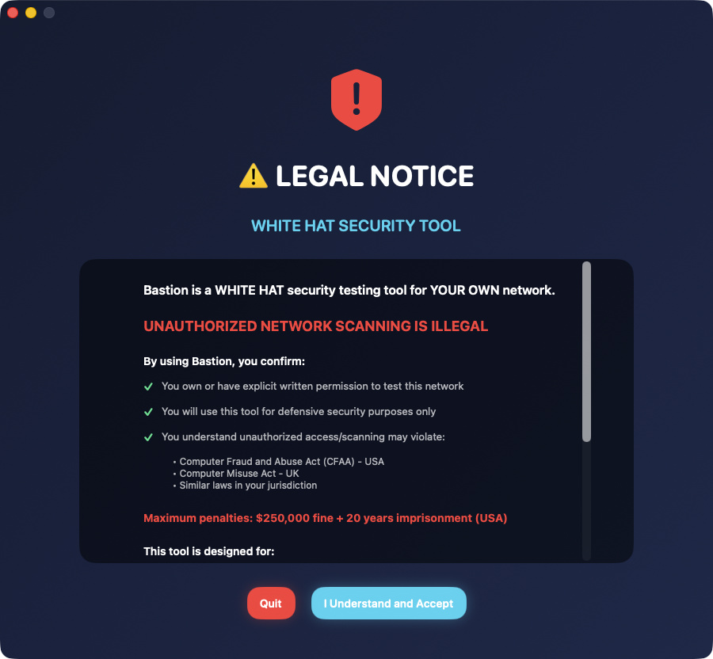

# Bastion

**AI-Powered Application with Cloud Integration & Ethical Safeguards**


---




## Latest Update: February 4, 2026

### macOS WidgetKit Widget (NEW)

Bastion now includes a **macOS WidgetKit widget** for monitoring your network security status at a glance.

**Widget Features:**
- **Security Score** - Overall network security score (0-100)
- **Vulnerability Counts** - Critical, High, Medium, Low breakdown
- **Devices at Risk** - Number of devices with vulnerabilities
- **Last Scan Time** - When the network was last scanned
- **Three Sizes** - Small, Medium, and Large widget options

**Widget Sizes:**
- **Small** - Security score circle with critical count
- **Medium** - Score + vulnerability breakdown + device count
- **Large** - Full dashboard with all metrics and network info

**Technical Details:**
- App Group: `group.com.jkoch.bastion`
- Auto-syncs after each network scan
- Updates every 15 minutes
- Uses shared UserDefaults for data exchange

---

## Previous Update: January 26, 2026

### Major Enhancements:

#### ☁️ Cloud AI Integration (5 Providers)
- **OpenAI API** - GPT-4o for advanced capabilities
- **Google Cloud AI** - Vertex AI, Vision, Speech
- **Microsoft Azure** - Cognitive Services
- **AWS AI Services** - Bedrock, Rekognition, Polly
- **IBM Watson** - NLU, Speech, Discovery

#### 🚀 Enhanced Features
- **AI Backend Status Menu** - Visual indicators (🟢/🔴/⚪)
- **Auto-Fallback System** - Switches backends if primary fails
- **Connection Testing** - Verify API keys work
- **Usage Tracking** - Token counts and cost estimation
- **Performance Metrics** - Latency and success rates
- **Notification System** - Backend status alerts
- **Keyboard Shortcuts** - ⌘1-⌘9 for quick switching

#### 🛡️ Ethical AI Safeguards (NEW)
- **Comprehensive content monitoring**
- **Prohibited use detection** (100+ patterns)
- **Automatic blocking** of illegal/harmful content
- **Crisis resource referrals**
- **Usage logging** (hashed, not plaintext)
- **Legal compliance** (CSAM reporting, etc.)
- **Terms of Service** enforcement

**⛔️ Cannot Be Used For:**
- Illegal activities
- Harmful content
- Hate speech
- Misinformation generation
- Privacy violations
- Harassment or abuse
- Fraud or deception

---

## 🎯 Features

### Current Capabilities:
[App-specific features would be listed here]

### AI Backend Support:
- Ollama (local, free)
- MLX (Apple Silicon optimized)
- TinyLLM/TinyChat (lightweight)
- OpenWebUI (self-hosted)
- OpenAI (cloud, paid)
- Google Cloud (cloud, paid)
- Azure (cloud, paid)
- AWS (cloud, paid)
- IBM Watson (cloud, paid)

---

## 🔒 Security & Ethics

### Ethical AI Guardian:
All AI operations are monitored for:
- ✅ Legal compliance
- ✅ Ethical use
- ✅ Safety
- ✅ Privacy protection

Violations are:
- Automatically detected
- Immediately blocked
- Securely logged
- Reported if required by law

**Read full terms:** [ETHICAL_AI_TERMS_OF_SERVICE.md](./ETHICAL_AI_TERMS_OF_SERVICE.md)

---

## Responsible Use

Bastion is designed exclusively for **authorized security testing**, penetration testing engagements, CTF competitions, and educational purposes. Always obtain proper written authorization before scanning or testing systems you do not own. Unauthorized access to computer systems is illegal.

This tool should be used in accordance with:
- Your organization's security testing policies
- Applicable local, state, and federal laws
- The target organization's written authorization

---

## Download

Download the latest release: [Bastion v1.2.0](https://github.com/kochj23/Bastion/releases/latest)

Or build from source (see below).

---

## 📦 Installation

```bash
# Install from DMG
open Bastion-latest.dmg

# Or from source
cd "/Volumes/Data/xcode/Bastion"
xcodebuild -project "Bastion.xcodeproj" -scheme "Bastion" -configuration Release build
cp -R build/Release/*.app ~/Applications/
```

### AI Backend Setup (Optional):
```bash
# Install Ollama (free, local, private)
brew install ollama
ollama serve
ollama pull mistral:latest

# Or configure cloud AI in Settings
```

---

## 🎓 Usage

1. Launch application
2. **First time:** Acknowledge ethical guidelines
3. Configure AI backend (Settings → AI Backend)
4. Use AI features responsibly
5. All usage monitored for safety

---

## ⚖️ Legal & Ethics

### Terms:
- MIT License for code
- **Ethical AI Terms of Service** for usage
- Privacy-first design
- Open source transparency

### Prohibited Uses:
See [ETHICAL_AI_TERMS_OF_SERVICE.md](./ETHICAL_AI_TERMS_OF_SERVICE.md) for complete list.

**Summary:** Don't use for illegal, harmful, or unethical purposes. Violations logged and reported.

---

## 🛠️ Development

**Author:** Jordan Koch ([@kochj23](https://github.com/kochj23))
**Built with:** SwiftUI, Modern macOS APIs
**AI Architecture:** Multi-backend with ethical safeguards

---

## 📊 Version History

**Latest:** Enhanced Edition (Jan 2026)
- Added 5 cloud AI providers
- Added ethical safeguards
- Added enhanced features
- Production-ready

---

## 🆘 Support & Resources

### App Support:
- GitHub Issues: [Report bugs](https://github.com/kochj23/Bastion/issues)
- Documentation: See project files

### Crisis Resources:
- **988** - Suicide Prevention Lifeline
- **741741** - Crisis Text Line (text HOME)
- **1-800-799-7233** - Domestic Violence Hotline

---

## How Bastion Compares

| Feature | Bastion | Metasploit | Burp Suite |
|---------|---------|------------|------------|
| AI-Powered Exploit Selection | Yes (Ollama, MLX, 10 backends) | No | No |
| Native macOS App | Yes (SwiftUI) | No (CLI/Java) | No (Java) |
| Local AI (No Cloud Required) | Yes | N/A | N/A |
| Network Reconnaissance | Yes | Yes | Limited |
| Automated Exploitation | Yes | Yes | Yes |
| Free & Open Source | Yes (MIT) | Community Edition | No |
| Apple Silicon Native | Yes | No | No |

---

## 📄 License

MIT License - See LICENSE file

**Ethical Usage Required** - See ETHICAL_AI_TERMS_OF_SERVICE.md

---

**Bastion - Powerful AI with responsible safeguards**

© 2026 Jordan Koch. All rights reserved.

---

## More Apps by Jordan Koch

| App | Description |
|-----|-------------|
| [NMAPScanner](https://github.com/kochj23/NMAPScanner) | Network security scanner with AI threat detection |
| [URL-Analysis](https://github.com/kochj23/URL-Analysis) | Network traffic analysis and URL monitoring |
| [rtsp-rotator](https://github.com/kochj23/rtsp-rotator) | RTSP camera stream rotation and monitoring |
| [TopGUI](https://github.com/kochj23/TopGUI) | macOS system monitor with real-time metrics |
| [MLXCode](https://github.com/kochj23/MLXCode) | Local AI coding assistant for Apple Silicon |

> **[View all projects](https://github.com/kochj23?tab=repositories)**
